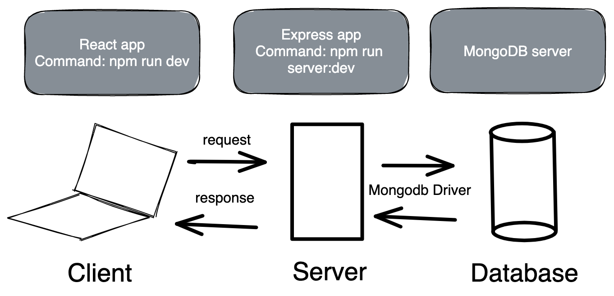

# Homework: Full Stack Games Hub App

### Learning Objectives

- Understand the relationship between client, server and database
- Be able to navigate a codebase that you haven't written

## Brief

Your boss has asked to you look over the codebase of a full-stack JavaScript application. The front-end is written in JavaScript using React, the back-end uses an Express server and a MongoDB database. Your task is to make yourself familiar with the codebase.

The application includes a README.md with instructions on running the application.



*Overview of the tech stack and tooling with commands*

*EDIT: Frontend is now written in React with the command to run `npm start`*

## MVP

### Task

Draw a diagram showing the dataflow through the application starting with a form submission, ending with the re-rendering of the page. This will involve a multi-direction data-flow with the client posting data to the server and the server sending data back to the client with the response. Detail the client, server and database in the diagram and include the names of the files involved in the process. If you're not sure what's happening when - `console.log` all the things in all the places!

### Questions

1. What is responsible for defining the routes of the `games` resource?
    gamesRouter(createRouter) + create_route.js + server.js

2. What do you notice about the folder structure?  Whats the client responsible for? Whats the server responsible for?
    client is responsible for the handling the intake and display of the data
    server is responsible for the manipulation and storage of the data

    client is front end, server is back end

3. What are the the responsibilities of server.js?
    Communicate with MongoDB

    - using `express.json()`, which enables the server to access the body from requests
    - serving static files (the client directory) to the browser
    - enables cors (we'll discuss this in more detail later)
    - connecting to the `games_hub` database using the MongoDB driver
    - accessing the `games` collection from the database and pass it to `createRouter`
    - delegating the routing for the `games` resource to `gamesRouter` on the path `/api/games`
    - listening for requests being made on on a specific port

4. What are the responsibilities of the `gamesRouter`?
    Using restful roots and the correct method when communicating with the database

    `gamesRouter` is responsible for defining the routes for the `games` resource and interacting with the database for each route as appropriate.

5. What process does the the client (front-end) use to communicate with the server?
    GameForm for adding games and GameCard to remove games, both with post request

    The client sends `fetch` requests via the `GamesService` to the server via the set of routes defined in the router (e.g. 'localhost:3000/api/games').

    The file is called `GamesService.js` as its responsible for making the connection with our games api.  You may also see this named `service.js` or `api` however if you're making calls to various end points its a good idea to name the file relating to the service its consuming.


6. What optional second argument does the `fetch` method take? And what is it used for in this application? Hint: See [Using Fetch](https://developer.mozilla.org/en-US/docs/Web/API/Fetch_API/Using_Fetch) on the MDN docs
    init can be use to set different settings, for example, the method, headers, mode, cache..as below.
    const myInit = {
        method: "GET",
        headers: myHeaders,
        mode: "cors",
        cache: "default",


        When `fetch` is passed only a URL as an argument, it makes a GET request by default. However `fetch` takes an optional second argument of an `init` object that can be used to specify the request settings.

        In this application the `request` helper's methods `post` and `delete` both pass `fetch` an object specifying the type of request. Additionally, in the case of the `post` method, it is also used to send the body of the request and specify the body type as JSON using a header.

        ```js
        fetch('http://localhost:3000/api/games', {
        method: 'POST',
        body: JSON.stringify(game),
        headers: { 'Content-Type': 'application/json'}
        })
        .then(res => res.json())

7. Which of the games API routes does the front-end application consume (i.e. make requests to)?
    delete("/:id")
    post("/")


    - index (GET)
    - create (POST)
    - destroy (DELETE)

8. What are we using the [MongoDB Driver](http://mongodb.github.io/node-mongodb-native/) for?
    Storing and modifying the data

    The MongoDB Driver is a library that enables us interact with the MongoDB database from inside our JavaScript application.


## Extension

Why do we need to use [`ObjectId`](https://mongodb.github.io/node-mongodb-native/api-bson-generated/objectid.html) from the MongoDB driver?

    When the front-end makes a request regarding a specific game (SHOW, UPDATE, DELETE), the server access the ID of the particular game from the params object. This is always a string. To query the database for an object of a particular ID, if we ask it for the object with the ID of string type, it will never find a match. It needs us to make the query with an instance of `ObjectId`. We create the instance of `ObjectId` by passing in the ID as a string, for example, `ObjectId("5af17fe430e043c3e62149b8")`.

Add to your diagram the dataflow for removing a game.

view <-> GameCard <-> GameGrid <-> GamesContainer <-> GamesService <-> Server <-> DB
